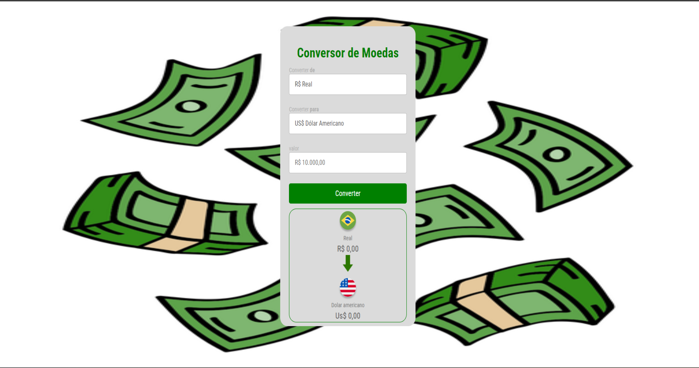

<h1 align ="center"> Conversor de Moedas </h1>

 

## Sobre o Projeto

O projeto foi realizado nas  aulas  de Javascript do <a href="https://rodolfomori.com.br/devclub/">DevClub</a>. Conseguimos utilizar o conteúdo teorico na pratica, usando as linguagens de programação onde podemos ver o contato do usuário com o site.
 
No projeto foi utilizado os softwares vscode e figma,deixando nossa criativida e pensamenton logico como experiência.
 
## 💻Tecnologias utilizadas

## Desktop

   
  
 

